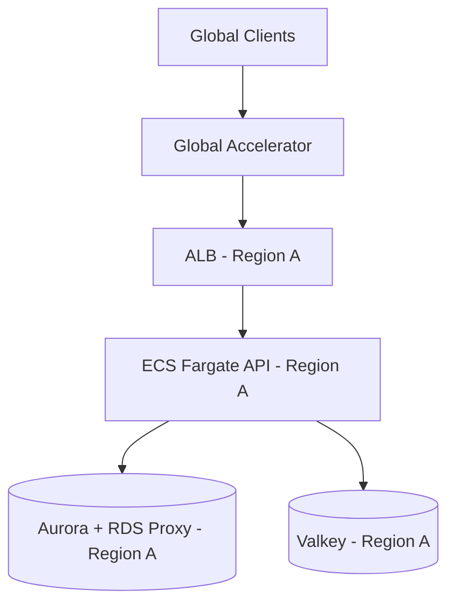
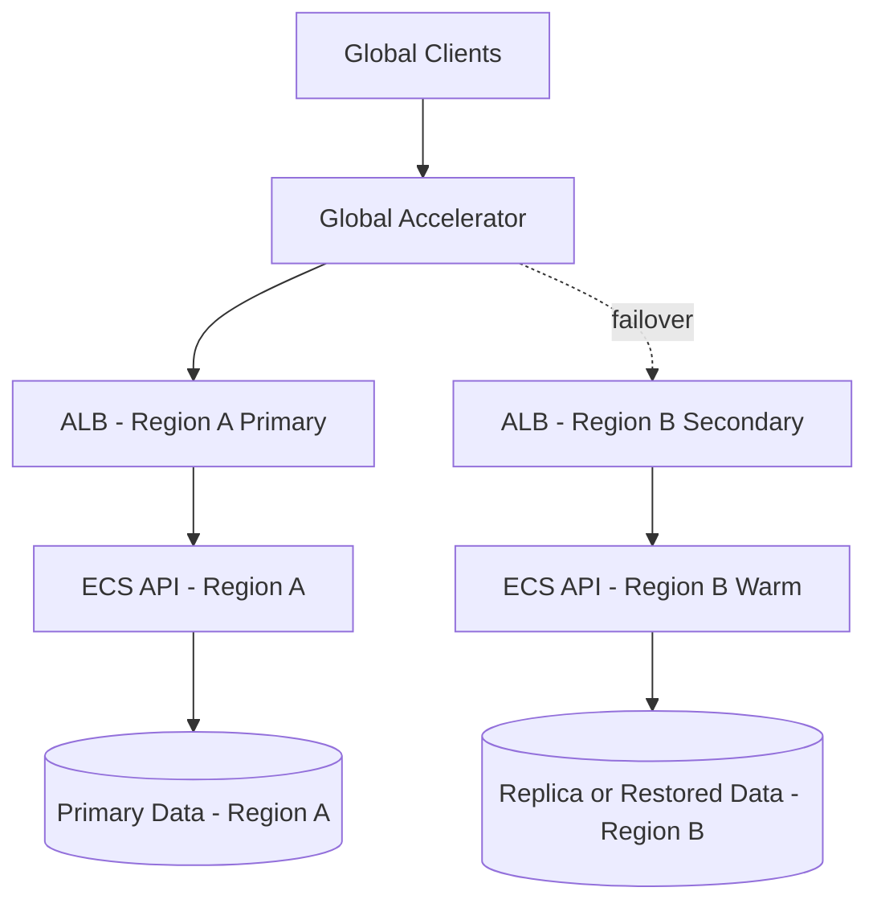
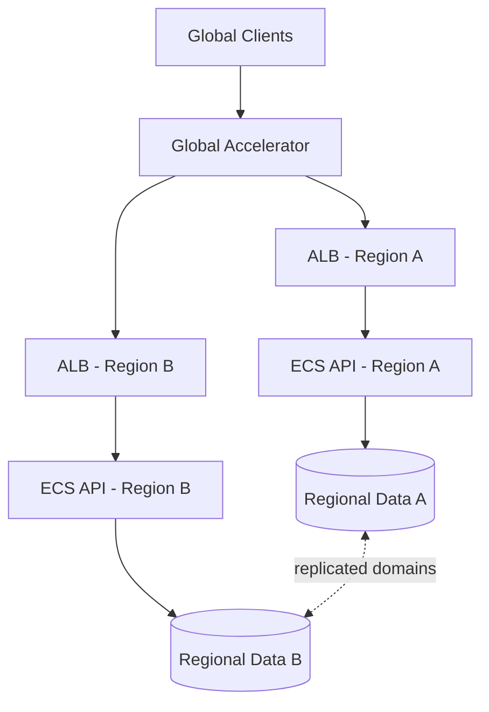

# Global Availability Guide

Use this guide to evolve this starter from a single-region deployment to a
globally available backend API.

## Table of Contents

- [Goals](#goals)
- [Reference Topologies](#reference-topologies)
- [Topology Progression](#topology-progression)
- [Data Layer Strategy](#data-layer-strategy)
- [Traffic Management](#traffic-management)
- [Resilience Checklist](#resilience-checklist)
- [Operational Drills](#operational-drills)

## Goals

- Keep API latency predictable for users in multiple geographies.
- Reduce regional blast radius and improve recovery posture.
- Maintain contract and auth behavior consistently across regions.

## Reference Topologies

### Single Region (Baseline)

### Multi-Region Active/Passive

### Multi-Region Active/Active (Advanced)

## Topology Progression

### 1) Single Region (Baseline)

- ALB + ECS Fargate + Aurora + Valkey in one region.
- Best starting point for most teams.
- Add synthetic checks and load tests before scaling topology complexity.

### 2) Single Region + Global Edge

- Add Global Accelerator in front of ALB.
- Improves network path quality and failover behavior.
- Good step when users are globally distributed but your write path remains
  region-local.

### 3) Multi-Region Active/Passive

- Primary region handles traffic.
- Secondary region is warm and ready for failover.
- Use health checks, tested runbooks, and clear RTO/RPO targets.

### 4) Multi-Region Active/Active (Advanced)

- Serve traffic from multiple regions concurrently.
- Requires explicit consistency strategy per domain:
  - Strong consistency domains remain region-pinned.
  - Eventual consistency domains replicate asynchronously.

## Data Layer Strategy

- Classify data by consistency and failover needs:
  - **Strong consistency:** auth sessions, critical writes, billing.
  - **Eventual consistency:** analytics, feeds, search indexes.
- Favor idempotent write APIs and request IDs for safe retries.
- Store immutable audit events to simplify reconciliation after failovers.
- Version contracts (`/api/v1`) and keep behavior uniform across regions.

## Traffic Management

- Start with Global Accelerator for stable edge ingress.
- Use health checks with explicit readiness criteria (`/healthz`).
- Keep per-region deploys independent; avoid hidden cross-region coupling.
- Expose region and request IDs in logs and traces for incident triage.

## Resilience Checklist

- [ ] Defined SLOs (availability, p95 latency, error rate) per region
- [ ] Documented RTO/RPO targets and owner
- [ ] Automated backup/restore tested on a schedule
- [ ] Failover runbook validated in non-production
- [ ] Load test profile and benchmark artifacts reviewed regularly
- [ ] Alerting tied to user-impact signals, not only infrastructure metrics

## Operational Drills

Run drills at least quarterly:

1. Simulate regional degradation (dependency timeout or service drain).
2. Validate routing and health-check behavior.
3. Verify alerting, runbook execution, and communication flow.
4. Record learnings and update `docs/OPERATIONS.md`.
